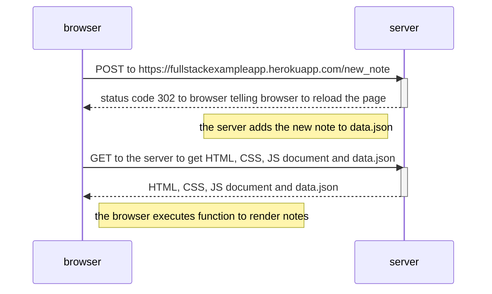

```mermaid
sequenceDiagram
    participant browser
    participant server

    browser->>server: POST to https://fullstackexampleapp.herokuapp.com/new_note
    activate server
    server-->>browser: status code 302 to browser telling browser to reload the page
    deactivate server
    note left of server: the server adds the new note to data.json
    browser->>server: GET to the server to get HTML, CSS, JS document and data.json
    activate server
    server-->>browser: HTML, CSS, JS document and data.json
    deactivate server
    note right of browser: the browser executes function to render notes
```