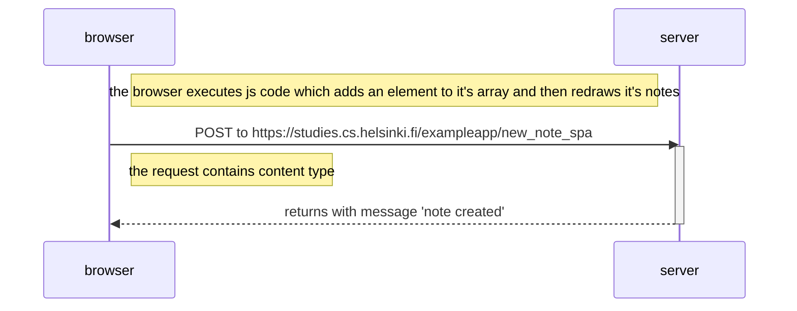

```mermaid
sequenceDiagram
    participant browser
    participant server
    note right of browser: the browser executes js code which adds an element to it's array and then redraws it's notes
    browser->>server: POST to https://studies.cs.helsinki.fi/exampleapp/new_note_spa
    activate server
    note right of browser: the request contains content type
    server-->>browser: returns with message 'note created'
    deactivate server
```
